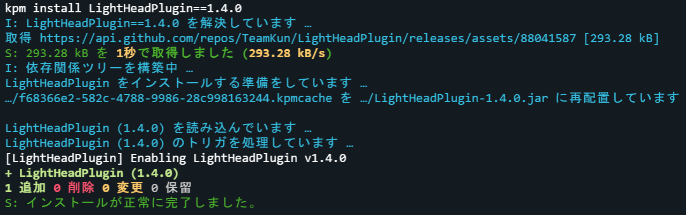
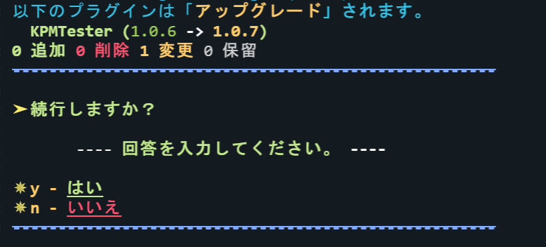
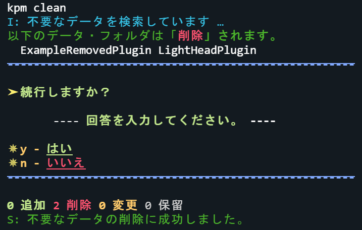
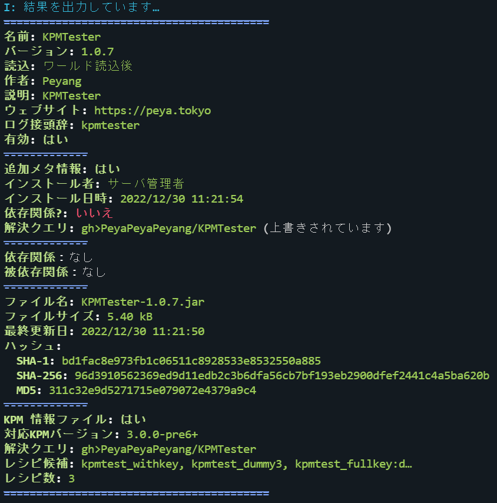

<h1 align="center">TeamKUNPluginManager</h1>

    
    
    
    
    
     
    リポジトリからプラグインおよびその依存関係を自動でダウンロードし, 高度なサーバ管理支援を行います。
     
    It automatically downloads plugins and their dependencies from repositories and provides advanced server management support.

## 概要 (Overview)

* TeamKUNPluginManager は、PaperMC プラグインを簡単かつ安全にインストールするツールです。
* GitHub や HTTP サーバなどのリポジトリから必要なプラグインを簡単な操作で自動ダウンロードし、インストールできます。
* KPM は、自動で依存関係を解決するため、手動で前提プラグインをインストールする必要がなくなります。
* KPMは不要なプラグイン（削除されたプラグインの依存関係として自動インストールされたもの等）を自動で検出し、管理者に報告します。  
  これにより、不要なプラグインを削除でき、パフォーマンスの向上につながります。
* 依存関係ツリーとメタデータを自動で構築し、プラグインの管理が簡単になります。
* グラフィカルなインタフェースで、必要なプラグインをより簡単に見つけられます。

## 言語サポート (Language Support)

KPM は、以下の言語に対応しています。

| 言語 (Language) | プラグイン (Plugin)     | ドキュメント (Documentation) |
|:--------------|:-------------------|:-----------------------|
| 日本語           | :white_check_mark: | :white_check_mark:     |
| English(US)   | :white_check_mark: | :x:                    |
| 日本語(関西弁)      | :white_check_mark: | :x:                    |

## 導入方法とドキュメント (Installation and Documentation)

* [こちら](https://kpm.kunlab.org) を参照してください。

## スクリーンショット (Screenshots)

 

